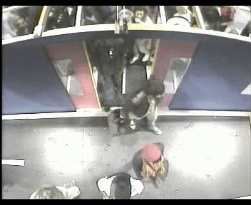
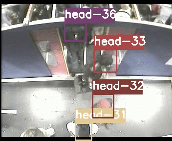
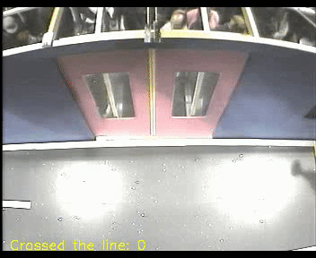
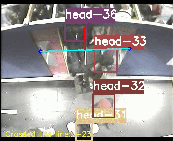
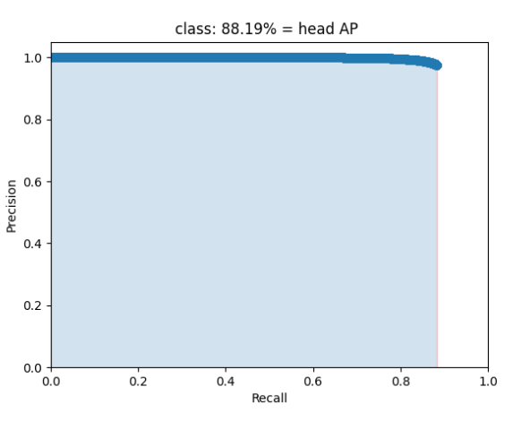

# Table of contents
-  [Introduction](#introduction)
-  [Requirements](#requirements)
-  [Downloading custom YOLOv4 weights](#custom-YOLOv4-weights)
-  [Training custom yolo model](#Training-custom-yolo-model)
-  [Counting people](#Counting-people)
-  [Evaluation](#evaluation)
-  [Command Line Args Reference](#Command-Line-Args-Reference)
-  [Credits](#credits)

## Introduction
Object tracking implemented with YOLOv4 (Keras), DeepSort (TensorFlow). YOLOv4 is a state of the art algorithm that uses deep convolutional neural networks to perform object detections. We can take the output of YOLOv4 feed these object detections into Deep SORT (Simple Online and Realtime Tracking with a Deep Association Metric) in order to create a highly accurate object tracker. Above pipeline was used on PAMELA-UANDES [DATASET](http://videodatasets.org/PAMELA-UANDES) in order to detect, track and count people getting on and off a metropolitan train. 

## Requirements
```bash
pip install -r requirements.txt
```

## Custom YOLOv4 weights
Our object tracker uses YOLOv4 to make the object detections, which deep sort then uses to track. There exists an official pre-trained YOLOv4 object detector model that is able to detect 80 classes. Unfortunately default detection fails when used on videos from PAMELA-UANDES DATASET. In order to fix that problem custom YOLO model had to be trained. Entire procedure is described here. 

## Running the Tracker with YOLOv4
All we need to do is run the object_tracker.py script to run our object tracker with YOLOv4 and DeepSort.
```bash

# Run yolov4 deep sort object tracker on video and print tracks statistics
python object_tracker.py --output outputs/output.avi --info

```
The output flag allows you to save the resulting video of the object tracker running so that you can view it again later. Video will be saved to the path that you set. (outputs folder is where it will be if you run the above command!)

As mentioned above, the resulting video will save to wherever you set the ``--output`` command line flag path to. I always set it to save to the 'outputs' folder. You can also change the type of video saved by adjusting the ``--output_format`` flag, by default it is set to AVI codec which is XVID.

Orginal YOLO vs Custom YOLO:

 

## Training custom yolo model
For creating custom yolov4 model Alex's [Darknet](https://github.com/AlexeyAB/darknet) was used. To start the procedure pamela-uandes [dataset](http://videodatasets.org/PAMELA-UANDES) need to be downloaded. Videos have to be put in adequate folders `data/dataset/video/test` and `data/dataset/video/train`. Csv annotation files have to be put in  `data/dataset/annotations/test` and `data/dataset/annotations/train` (these files are already in repo). To create images with proper yolo annotations run following command:
```bash
python ./tools/process_pamela.py
```
Then all you have to do is to follow instructions given in this [notebook](https://colab.research.google.com/drive/1zqRb08ljHvIIMR4fgAXeNy1kUtjDU85B?usp=sharing). The rest if needed custom config files are located in `data/darknet_files`. 

## Counting people 
To enable counting run tracker with following command:
```bash
python object_tracker.py --output outputs/output.avi --count
```
As soon as the video starts processing you will be presented with the output widow. Then you will be able to choose 2 points on the screen creating virtual line. People crossing this line will be counted.

Create line:



Final output:


## Evaluation
To evaluate detection AP first you need to run following commands:
```bash
#create txt files for every frame and process pamela ground truth files
python ./tools/create_files_for_evaluation.py 
#calculate mAP based on created files
python ./tools/calculate_map.py 
```
To evaluate detection metrics run following command:
```bash
python object_tracker.py --track_eval
```
PR curve:


## Command Line Args Reference
```bash
object_tracker.py:
  --[no]count: count people crossing the line the on screen
    (default: 'false')
  --[no]dont_show: dont show video output
    (default: 'false')
  --[no]info: show detailed info of tracked objects
    (default: 'false')
  --output: path to output video
  --output_format: codec used in VideoWriter when saving video to file
    (default: 'XVID')
  --[no]track_eval: enable tracking evaluation
    (default: 'false')
  --track_eval_gt_path: path to csv GT file from PAMELA dataset
    (default: 'data/dataset/annotations/train/A_d800mm_R1-Filt.csv')
  --video: path to input video or set to 0 for webcam
    (default: './data/video/test2.mpg')
  --weights: path to weights file
    (default: 'data/yolov4-custom_best.weights')
    
.\tools\process_pamela.py:
  --csv_dir: path to directory containing train and test annotations folders
    (default: 'data/dataset/annotations')
  --[no]dont_show: dont show video output
    (default: 'false')
  --output_dir: path to output video
    (default: './outputs')
  --output_format: codec used in VideoWriter when saving video to file
    (default: 'XVID')
  --output_images_dir: path to output video
    (default: 'data/dataset/images')
  --[no]save_GT_videos: save video with boxes from ground truth files
    (default: 'false')
  --size: resize images to
    (default: '416')
    (an integer)
  --video_dir: path to directory containing train and test video folders
    (default: 'data/dataset/video')
```

### Credits  

  * [tensorflow-yolov4-tflite](https://github.com/hunglc007/tensorflow-yolov4-tflite)
  * [Deep SORT Repository](https://github.com/nwojke/deep_sort)
  * [Deep SORT + YOLO](https://github.com/theAIGuysCode/yolov4-deepsort)
  * [Calculating mAP](https://github.com/Cartucho/mAP)
  * [Tracking evaluation](https://github.com/cheind/py-motmetrics)

